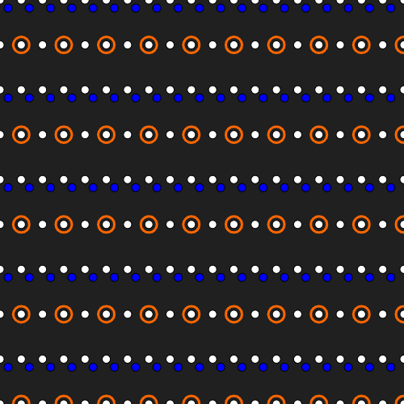

# Pretty Grid

## Table of contents

-   [Introduction](#introduction)
-   [Getting started](#getting-started)
-   [Documentation](https://github.com/VadimGouskov/pretty-grid/wiki)
    -   [API](https://github.com/VadimGouskov/pretty-grid/wiki/API)
    -   [Tutorials](https://github.com/VadimGouskov/pretty-grid/wiki/tutorials)
-   [Examples](#examples)

## Introduction

Creating and manipulating a grid layout on an x-y plane requires repetative code involving nested for loops and n-d arrays. `pretty-grid` makes this process more straight-forward, readable and versatile.

The example below illustrates how `pretty-grid` simplifies creating a grid layout with the following parameters:

```js
const COLS_AMOUNT = 5;
const ROWS_AMOUNT = 8;
const GRID_WIDTH = 500;
const GRID_HEIGHT = 500;
```

Using vanilla JavaScript:

```js
const COLS_DISTANCE = GRID_WIDTH / (COLS_AMOUNT - 1);
const ROWS_DISTANCE = GRID_HEIGHT / (ROWS_AMOUNT - 1);
const grid = [];

for (let i = 0; i < COLS_AMOUNT; i++) {
    grid[i] = [];
    for (let j = 0; j < ROWS_AMOUNT; j++) {
        grid[i][j] = {
            x: i * COLS_DISTANCE,
            y: j * ROWS_DISTANCE,
        };
    }
}
```

Using `pretty-grid`, this simplifies to:

```js
const grid = new Grid(COLS_AMOUNT, ROWS_AMOUNT, GRID_WIDTH, GRID_HEIGHT);
```

Using a couple of `pretty-grid`'s helper methods you can already create a complex looking grid layout:

```js
// Grid (cols, rows, width, height)
const grid = new Grid(20, 10, 500, 500);
grid.draw(point => whiteDot(point.x, point.y));
grid.draw(point => orangeCircle(point.x, point.y), and(oddRows(), oddCols()));
grid.translate(10,10)
    .draw(point => blueDot(point.x, point.y), evenRows());
...
```

> Check [this p5.js Playground](https://editor.p5js.org/VadimGouskov/sketches/6CiLATPQ2) for the full code example.

This results in:



> To make this example unopinionated, we illustrate this example using the `whiteDot`, `orangeCircle` and `blueDot` pseudo methods to draw a grid on an html canvas. You as the developer, implement your own functions to draw to your target of choice.

## Getting started

### Browser

For a browser based project, add the folowing script tag to your `index.html` file

```html
<script src="https://cdn.jsdelivr.net/npm/pretty-grid"></script>
```

All `pretty-grid` features can now be accessed from the `prettyGrid` global object.

```js
const grid = new prettyGrid.Grid(3, 5, 500, 500);
grid.draw(point => ...));
```

A browser example project can be found [here](https://github.com/VadimGouskov/pretty-grid/tree/main/examples/browser-simple-p5)

### Node

For a nodejs based project, install `pretty-grid` using:

```bash
npm install pretty-grid
```

import features from `pretty-grid`

```js
import { Grid } from 'pretty-grid';

const grid = new Grid(3, 5, 500, 500);
grid.draw(point => ...));
```

A node based example project can be found [here](https://github.com/VadimGouskov/pretty-grid/tree/main/examples/node-typescript-p5)

<br />

## Docs

The full documentation can be found [here](https://github.com/VadimGouskov/pretty-grid/wiki)

## Examples

-   [Hello World](https://editor.p5js.org/VadimGouskov/sketches/m7-A9JZzn)
-   [Translating](https://editor.p5js.org/VadimGouskov/sketches/z5YkEcAWR)
-   [Operators: AND](https://editor.p5js.org/VadimGouskov/sketches/mp0Y_3N-S)
-   [Operators: OR](https://editor.p5js.org/VadimGouskov/sketches/TsPk41HtS)
-   [Operators: NOT](https://editor.p5js.org/VadimGouskov/sketches/Y8WipTN7U)
-   [Operators: AND OR NOT Combined](https://editor.p5js.org/VadimGouskov/sketches/owm9JDEHe)
-   [Custom Operators](https://editor.p5js.org/VadimGouskov/sketches/mHWaqUVFP)
-   [Shapes: Ellipse Grids](https://editor.p5js.org/VadimGouskov/sketches/gDVloSS0J)
-   [README example](https://editor.p5js.org/VadimGouskov/sketches/6CiLATPQ2)

> These editable code examples are created using p5.js playground. Feel free to use `pretty-grid` in combination with other js (drawing) libraries. The full p5.js playground collection can be found [here](https://editor.p5js.org/VadimGouskov/collections/1uEQLKloQ).

## Contributing

The goal of `pretty-grid` is to make grid drawing easier for everybody.
If you have a suggestion about the docs, API, tutorials or somethıng else, please post it in one of the folowing ways:

-   [Open an issue](https://github.com/VadimGouskov/pretty-grid/issues) on GitHub and tag it with the green "Suggestion" label
-   Fill out [this form](https://forms.office.com/r/Pz7nQk2iBA)

## TODO

-   Global Grid origin modes
-   push/pop current state of the grid
-   rotate method
-   transform method: (supply your own function to apply transormations to the GridPoints)
-   3D Grid
-   ...
